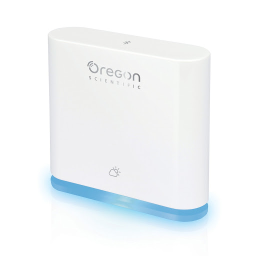
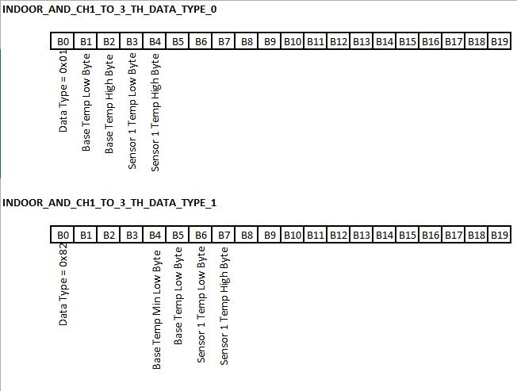

# Raspberry Pi Zero W to Oregon Scientific IDTBA228

Connect a Raspberry Pi Zero W to an Oregon Scientific BLE temperature station and read temperature values in Python.

Credit: [Arnø](https://www.instructables.com/id/Connect-Raspberry-Pi-to-Oregon-Scientific-BLE-Weat/)



## Hardware

* Raspberry Pi Zero W
* Oregon Scientific IDTBA228 weather station

## Software

A Raspberry Pi Zero W with Raspbian Stretch has all of the tools to scan for your weather station. To find it's BLE address:

`$ sudo hcitool lescan`

You should be able to see it in the list, something like:

`<BLE ADDRESS> IDTBA228`

### Retrieve temperature data from the command line

Now that we know the address, we can connect to it:

```bash
$ sudo gatttool -b <BLE ADDRESS> -t random -I
[<BLE ADDRESS>][LE]> connect
Attempting to connect to <BLE ADDRESS>
Connection successful
[<BLE ADDRESS>][LE]> primary
attr handle: 0x0001, end grp handle: 0x0007 uuid: 00001800-0000-1000-8000-00805f9b34fb
attr handle: 0x0008, end grp handle: 0x0008 uuid: 00001801-0000-1000-8000-00805f9b34fb
attr handle: 0x0009, end grp handle: 0x0021 uuid: 74e7fe00-c6a4-11e2-b7a9-0002a5d5c51b
attr handle: 0x0022, end grp handle: 0x002e uuid: 0000180a-0000-1000-8000-00805f9b34fb
attr handle: 0x002f, end grp handle: 0xffff uuid: 0000180f-0000-1000-8000-00805f9b34fb
```

To receive data from it, we enable indication by writting 0x0002 (0x0001 for notification) in Client Characteristic Configuration Descriptor (UUID: 0x2902) of each characteristic. Write shall be placed in little endian format so:

```bash
[<BLE ADDRESS>][LE]> char-write-req 0x000c 0200
Characteristic value was written successfully
[<BLE ADDRESS>][LE]> char-write-req 0x000f 0200
Characteristic value was written successfully
[<BLE ADDRESS>][LE]> char-write-req 0x0012 0200
Characteristic value was written successfully
[<BLE ADDRESS>][LE]> char-write-req 0x0015 0100
Characteristic value was written successfully
[<BLE ADDRESS>][LE]> char-write-req 0x0018 0200
Characteristic value was written successfully
[<BLE ADDRESS>][LE]> char-write-req 0x001b 0200
Characteristic value was written successfully
[<BLE ADDRESS>][LE]> char-write-req 0x001e 0200
Characteristic value was written successfully
[<BLE ADDRESS>][LE]> char-write-req 0x0021 0200
Characteristic value was written successfully
[<BLE ADDRESS>][LE]> char-write-req 0x0032 0100
Characteristic value was written successfully
Indication   handle = 0x000e value: 00 19 01 00 00 00 00 00 
Indication   handle = 0x0017 value: 01 f9 00 1d 01 ff 7f ff 7f 7f 7f 7f 7f ff ff 7f 7f 7f 7f 7f 
Indication   handle = 0x0017 value: 82 7f 7f 7f f9 00 e3 00 1d 01 b6 00 ff 7f ff 7f ff 7f ff 7f 
Indication   handle = 0x0020 value: 01 ff 7f ff 7f ff 7f ff 7f 7f 7f 7f 7f ff ff 7f 7f 7f 7f 7f 
Indication   handle = 0x0020 value: 82 7f 7f 7f ff 7f ff 7f ff 7f ff 7f ff 7f ff 7f ff 7f ff 7f 
Indication   handle = 0x001d value: 11 12 0b 11 11 1e 34 ff 00 80 00 80 ff ff ff ff ff ff ff ff 
[<BLE ADDRESS>][LE]> 
```

In return, you should start getting indications/notifications. The relevant ones for us are `INDOOR_AND_CH1_TO_3_TH_DATA` indications (so handle 0x0017).

For each round of indications, we get two data packets of 20 bytes each. The most significant byte indicates the type of data (Type 0 or Type 1). See below for more details on the data packets.



You can also retrieve the battery level:

```bash
$ sudo gatttool -b <BLE ADDRESS> -t random --char-read --handle=0x0031

or

$ sudo gatttool -b <BLE ADDRESS> -t random --char-read --uuid=0x2A19

```

Or use the `bluetoothctl` tool ([Adafruit video](https://www.youtube.com/watch?v=5fQR2PHMDWE&feature=youtu.be&t=4644)):

```bash
$ sudo bluetoothctl
[bluetooth]# scan on
[bluetooth]# connect <BLE ADDRESS>
[IDTBA228]# select-attribute /org/bluez/hci0/dev_<BLE ADDRESS>/service002f/char0030
[IDTBA228:/service002f/char0030]# read
Attempting to read /org/bluez/hci0/dev_<BLE ADDRESS>/service002f/char0030
[CHG] Attribute /org/bluez/hci0/dev_<BLE ADDRESS>/service002f/char0030 Value: 0x64
```

### Retrieve temperature data via Python

First install [bluepy](https://github.com/IanHarvey/bluepy):

```bash
$ sudo apt-get install python-pip libglib2.0-dev
$ sudo pip install bluepy
```

Now run the python script handing in the address of your weather station:

```bash
$ python temperature.py <BLE ADDRESS>
```

If you'd rather get the script to scan for the weather station, you need to run it with root privileges:

```bash
$ sudo python temperature.py
```

You should see output:

```bash
$ sudo python bleWeatherStation.py FC:4B:13:35:50:EA 
2024-04-02 18:24:38,906: WeatherStation connected !
2024-04-02 18:24:38,909: Notifications enabled
2024-04-02 18:24:39,149: Notification received
2024-04-02 18:24:39,150: handle e = b'019f00007f070000321710020418'
2024-04-02 18:30:50,917: Notification received
2024-04-02 18:30:50,918: indoor_type0 = b'390304fa00023301ba27011e10020418'
2024-04-02 18:30:50,919: Indoor temp : 25.0°C
2024-04-02 18:30:50,919: Indoor humidity : 51.0%
2024-04-02 18:30:50,920: Indoor pressure : 1017.0hPa
2024-04-02 18:45:51,037: Notification received
2024-04-02 18:45:51,038: indoor_type0 = b'3a0304fc00023301b927012d10020418'
2024-04-02 18:45:51,038: Indoor temp : 25.2°C
2024-04-02 18:45:51,039: Indoor humidity : 51.0%
2024-04-02 18:45:51,039: Indoor pressure : 1016.9hPa
2024-04-02 19:00:51,109: Notification received
```
### Run it hourly via a crontab

To set it up to run hourly, edit your crontab:

```bash
$ crontab -e
@hourly python /home/pi/temperature.py <BLE ADDRESS> >> /home/pi/cron-temperature.log
```

## TODO

* Setup a [Flask](http://flask.pocoo.org) app to expose the temperature getting via an API - maybe use https://www.flaskapi.org
* Connect that Flask app to Apple HomeKit using https://github.com/ikalchev/HAP-python
